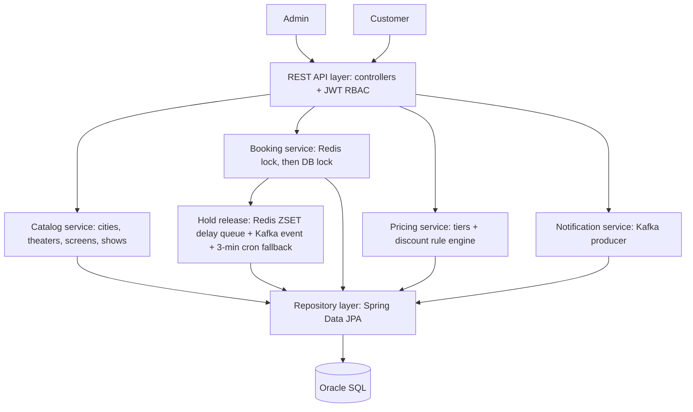
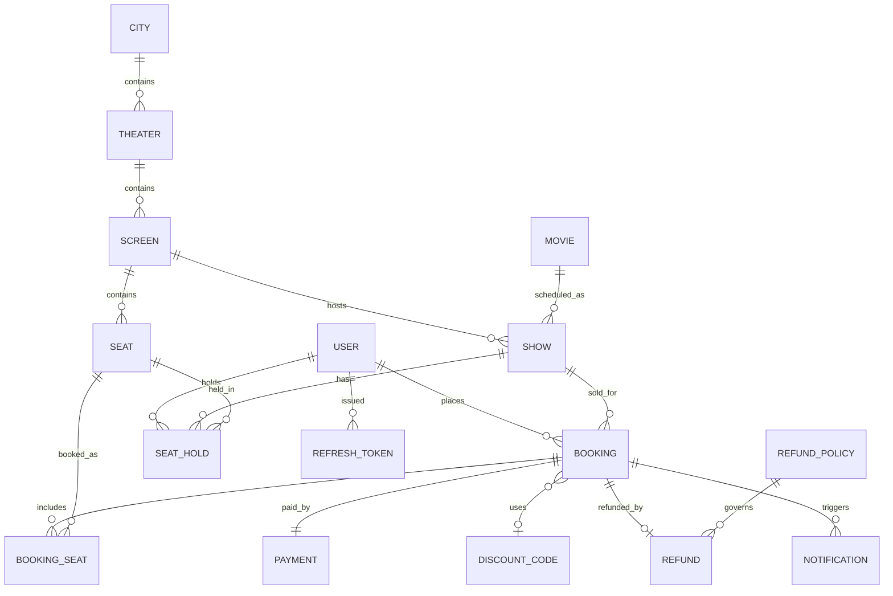

# Movie Ticket Booking System

> **Status of this repo**: design phase complete (architecture, data model, API contracts, project scaffold). Implementation (actual Java code) has not started yet. This README is written to be fully self-contained — everything needed to finish the implementation is here. No other context, conversation history, or external document should be required.

---

## 1. The assignment (restated in full)

This is an SDE-2 take-home. Time limit: 48 hours from assignment. Stack: Spring Boot.

**The brief**: a movie ticket booking system at scale with multiple cities, multiple theaters per city, multiple shows per theater, and seat-level booking. The system must support:
- Seat selection with time-bound holds that release automatically on expiry
- Multiple pricing tiers (regular, premium, weekend) and discount codes
- Payment, booking confirmation, and refunds on cancellation under configurable refund policies
- Correct serialization of concurrent booking attempts on the same seat — no double-allocation
- Confirmation and reminder notifications delivered without blocking the booking flow

**Roles**:
- `ADMIN` — manage cities, theaters, shows, seat layouts, pricing tiers, and refund policies
- `CUSTOMER` — browse shows, book and cancel seats, view booking history

**In scope**: REST APIs covering core flows; persistence to a database; basic role-based access control; input validation and error handling; unit and integration tests for core flows.

**Out of scope**: UI/frontend; deployment, containerization, or CI/CD; distributed systems or microservices (beyond what's needed for the locking/eventing described below); advanced authentication (OAuth, SSO, MFA); production-grade observability/monitoring/alerting.

**What must be submitted**: a GitHub repository with multiple commits during development, a `README.md` (this file), the `Agents.md`/`Claude.md` file used during development, the skills used during development, all raw files used during development, and a video recording (max 10 minutes) covering: the approach and high-level solution, the tech stack and reasoning, the AI workflow used, and the testing approach.

The PRD is intentionally open-ended — scoping decisions (which entities, which APIs, which edge cases, what to leave out) are part of the evaluation. Every meaningful assumption made below is the result of an explicit design conversation, not a unilateral choice — see Section 14.

---

## 2. Tech stack

| Concern | Choice | Why |
|---|---|---|
| Language / framework | Java + Spring Boot | Mandated by the assignment |
| Build tool | Maven | |
| Database | Oracle SQL | |
| Cache / distributed lock | Redis | Fast, cross-instance seat locking |
| Event bus | Apache Kafka | Reliable broadcast of hold-expiry and notification events |
| Auth | JWT — access + refresh token pair, refresh rotation, revocation list | |
| API docs | springdoc-openapi (Swagger UI) | |

---

## 3. Architecture



### 3.1 Seat booking concurrency (two layers)

1. **Redis distributed lock** — acquired the instant a user selects a seat: `SET seat-lock:{showId}:{seatId} {userId} NX EX {holdSeconds}`. Atomic; only succeeds if the key doesn't already exist. This is what makes seat selection fast and correctly serialized across multiple app instances without hitting the DB on every selection attempt.
2. **DB pessimistic lock** (`SELECT ... FOR UPDATE`) — applied at final booking confirmation, inside a DB transaction, as the final source of truth. Even if something raced past the Redis layer, this is the last line of defense before a booking commits.

### 3.2 Seat hold expiry (three layers, decreasing speed, increasing reliability)

1. **Primary — Redis delayed queue**: a Redis sorted set (ZSET) keyed by hold ID, scored by expiry timestamp (epoch millis). A custom polling worker (no third-party library — e.g. Redisson was considered and rejected in favor of full control and no extra dependency) runs `ZRANGEBYSCORE(0, now)` on a short interval (every 1–2 seconds), pops due holds, releases the Redis lock, and updates the DB record. Chosen over simple TTL + keyspace notifications because Redis pub/sub is fire-and-forget — an event can be silently lost if a subscriber is briefly offline. The ZSET approach is durable: nothing is lost, the worker just picks it up on its next poll.
2. **Event broadcast — Kafka**: once the Redis worker (or the cron fallback) detects an expired hold, it publishes a `SeatHoldExpired` event to a Kafka topic. Kafka is **not** used to implement the delay itself (it has no native delay/TTL mechanism) — it's a reliable event bus so every interested downstream consumer (seat-release side effects, audit log, future waitlist features) gets the event with retry/replay semantics.
3. **Safety net — cron fallback**: a `@Scheduled` job runs every 3 minutes, scanning the DB directly for `SeatHold` rows with `status = HELD` and `held_at` older than 10 minutes. Catches anything the above two layers might miss. Must be idempotent — check whether the Redis lock still exists before forcing a release.

### 3.3 Payment (mocked — real gateways are out of scope)

- `POST /api/bookings` returns immediately with `status = PENDING_PAYMENT` — the user is never blocked waiting on payment processing.
- An async worker simulates gateway processing (artificial delay), then calls back in-process to flip the booking to `CONFIRMED` or `FAILED`.
- **Idempotency key** required on the booking-confirm endpoint (`Idempotency-Key` header), so retries (network blips, client double-submits) can't double-charge or double-book.

### 3.4 Notifications

- Delivered via the same Kafka pipeline used for hold-expiry events. `BookingConfirmed` / `BookingCancelled` events are published, consumed asynchronously by a notification consumer — never blocking the booking flow.
- Channels: both email and SMS stubs (e.g. log-formatted fake senders), channel configurable per notification type.

### 3.5 Pricing & discounts

- Pricing tiers: `REGULAR`, `PREMIUM`. Weekend pricing is a separate rate on the same tier (not a third tier) — looked up via `PricingPolicy`, keyed by tier, with a `weekday_price` and `weekend_price` column. Whether a show counts as "weekend" is computed from `Show.start_time` (Saturday/Sunday) at price-calculation time, not stored.
- Discount codes: rule engine implemented as **plain Java** (Strategy/Specification pattern), not a third-party rules library (Easy Rules was considered and rejected — the four condition types below are fixed and known at compile time, not admin-authored at runtime, so a full rules engine would be unjustified abstraction). Conditions stack via implicit AND:
  - `DateRangeRule` — code valid only between `valid_from` and `valid_to`
  - `MinSeatsRule` — booking must include at least `min_seats` seats
  - `TierSpecificRule` — code only applies to seats of `applicable_tier` (or any tier if null)
  - `UsageLimitRule` — code has been used fewer than `usage_limit` times total

### 3.6 Refunds

- Time-based tiered structure (e.g. >24h before show = 100%, 12–24h = 50%, <12h = 0%) stored as `RefundPolicy` rows. The rule **structure** is fixed (time-based only, not a composable engine like discounts) — but the tier values themselves are admin-CRUD-able via the API, per the requirement that admins manage refund policies.
- **Assumption**: if a cancellation's hours-before-show doesn't fall into any configured tier (e.g. gaps in admin-defined ranges), default to 0% refund. Document this clearly if implemented differently.

### 3.7 Seat layouts

- Flexible JSON-based seat map per screen (`Screen.layout_metadata`) — supports irregular row lengths, aisles, and curved-screen layouts, rather than a forced uniform rows × columns grid. On screen creation, the layout JSON is parsed and individual `Seat` rows are generated from it (seats are real DB rows, not derived on the fly, so they can be locked/booked/queried efficiently).

### 3.8 Auth / RBAC

- JWT-based. On login: issue a short-lived access token (claims: `userId`, `role`) and a longer-lived opaque refresh token (stored hashed in the `RefreshToken` table).
- On refresh: validate the refresh token against the DB (not revoked, not expired) → issue a **new** access token and a **new** refresh token, and mark the old refresh token revoked (rotation).
- On logout: mark the current refresh token revoked.
- `JwtAuthenticationFilter` extracts the `Authorization: Bearer <token>` header, validates signature + expiry, and populates the Spring Security context with `ROLE_ADMIN` / `ROLE_CUSTOMER`.
- Endpoint security: `/api/admin/**` requires `ROLE_ADMIN`; booking/hold endpoints require `ROLE_CUSTOMER`; browse endpoints (`/api/cities`, `/api/theaters`, `/api/shows/**`) and `/api/auth/**` are public.

---

## 4. Data model



### Full entity field lists

**User**
| Field | Type | Notes |
|---|---|---|
| id | UUID | PK |
| name | String | |
| email | String | unique, not null |
| password_hash | String | bcrypt or similar — never store plaintext |
| role | enum(`ADMIN`, `CUSTOMER`) | |
| created_at, updated_at | timestamp | |

**City** — id (PK), name, state, country

**Theater** — id (PK), city_id (FK → City), name, address

**Screen** — id (PK), theater_id (FK → Theater), name, layout_metadata (JSON/CLOB — the flexible seat map: rows, aisles, curve descriptors), total_seats (derived count)

**Seat** — id (PK), screen_id (FK → Screen), seat_code (e.g. `A1`, unique within screen), row_label, column_position, tier (enum `REGULAR`/`PREMIUM`), is_active (boolean, for seats taken out of service)

**Movie** — id (PK), title, duration_minutes, language, genre, rating

**Show** — id (PK), screen_id (FK → Screen), movie_id (FK → Movie), start_time, end_time (derived: start_time + movie.duration), status (enum `SCHEDULED`/`CANCELLED`/`COMPLETED`)

**SeatHold**
| Field | Type | Notes |
|---|---|---|
| id | UUID | PK |
| show_id | FK → Show | |
| seat_id | FK → Seat | |
| user_id | FK → User | |
| status | enum(`HELD`, `EXPIRED`, `CONSUMED`) | `CONSUMED` once it becomes part of a confirmed booking |
| held_at | timestamp | |
| expires_at | timestamp | |
| redis_lock_key | String | mirrors the Redis key, for debugging/audit |

**Booking**
| Field | Type | Notes |
|---|---|---|
| id | UUID | PK |
| user_id | FK → User | |
| show_id | FK → Show | |
| status | enum(`PENDING_PAYMENT`, `CONFIRMED`, `FAILED`, `CANCELLED`) | |
| discount_code_id | FK → DiscountCode | nullable |
| subtotal_amount, discount_amount, total_amount | decimal | |
| idempotency_key | String | unique |
| created_at, confirmed_at | timestamp | confirmed_at nullable |

**BookingSeat** — id (PK), booking_id (FK → Booking), seat_id (FK → Seat), price_charged (decimal — snapshot of price at booking time, since pricing policy can change later)

**Payment** — id (PK), booking_id (FK → Booking, unique — one payment per booking), status (enum `PENDING`/`SUCCESS`/`FAILED`), amount, idempotency_key (unique), initiated_at, resolved_at (nullable)

**DiscountCode**
| Field | Type | Notes |
|---|---|---|
| id | UUID | PK |
| code | String | unique |
| description | String | |
| discount_type | enum(`PERCENTAGE`, `FLAT`) | |
| discount_value | decimal | |
| valid_from, valid_to | datetime | nullable = unbounded |
| min_seats | int | nullable = no minimum |
| applicable_tier | enum(`REGULAR`,`PREMIUM`) | nullable = any tier |
| usage_limit | int | nullable = unlimited |
| usage_count | int | default 0 |
| is_active | boolean | |

**PricingPolicy** — id (PK), tier (enum `REGULAR`/`PREMIUM`), weekday_price, weekend_price, effective_from (nullable)

**RefundPolicy** — id (PK), hours_before_show_min (int), hours_before_show_max (int, nullable = no upper bound), refund_percent (decimal 0–100)

**Refund** — id (PK), booking_id (FK → Booking), refund_policy_id (FK → RefundPolicy), amount, status (enum `PENDING`/`PROCESSED`/`FAILED`), processed_at (nullable)

**Notification** — id (PK), booking_id (FK → Booking), user_id (FK → User), type (enum `BOOKING_CONFIRMATION`/`CANCELLATION`/`REMINDER`), channel (enum `EMAIL`/`SMS`), status (enum `PENDING`/`SENT`/`FAILED`), sent_at (nullable)

**RefreshToken** — id (PK), user_id (FK → User), token_hash (String — never store the raw token), issued_at, expires_at, revoked (boolean, default false)

---

## 5. API surface

All endpoints under `/api`. Auth via `Authorization: Bearer <access_token>` unless marked public.

### Auth (public)
| Method | Path | Description |
|---|---|---|
| POST | `/api/auth/register` | Create a customer account |
| POST | `/api/auth/login` | Returns access + refresh token pair |
| POST | `/api/auth/refresh` | Rotates refresh token, returns new pair |
| POST | `/api/auth/logout` | Revokes the current refresh token |

### Admin — catalog (`ROLE_ADMIN`)
| Method | Path | Description |
|---|---|---|
| POST/GET | `/api/admin/cities` | Create / list |
| PUT/DELETE | `/api/admin/cities/{id}` | Update / delete |
| POST | `/api/admin/theaters` | Create (`cityId` in body) |
| GET | `/api/admin/theaters?cityId=` | List |
| PUT/DELETE | `/api/admin/theaters/{id}` | Update / delete |
| POST | `/api/admin/theaters/{theaterId}/screens` | Create screen with JSON seat-layout; generates `Seat` rows |
| GET | `/api/admin/screens/{id}` | Get screen + layout |
| PUT | `/api/admin/screens/{id}/layout` | Replace layout (regenerates seats; blocked if active bookings exist) |
| POST/GET | `/api/admin/movies` | Create / list |
| PUT | `/api/admin/movies/{id}` | Update |
| POST | `/api/admin/shows` | Create (`screenId`, `movieId`, `startTime`) |
| GET | `/api/admin/shows` | List (admin view, all statuses) |
| PUT/DELETE | `/api/admin/shows/{id}` | Update / cancel |

### Admin — pricing & policy (`ROLE_ADMIN`)
| Method | Path | Description |
|---|---|---|
| POST/GET | `/api/admin/pricing-policies` | Create / list |
| PUT | `/api/admin/pricing-policies/{id}` | Update |
| POST/GET | `/api/admin/discount-codes` | Create / list |
| PUT/DELETE | `/api/admin/discount-codes/{id}` | Update / deactivate |
| POST/GET | `/api/admin/refund-policies` | Create / list |
| PUT/DELETE | `/api/admin/refund-policies/{id}` | Update / remove |

### Customer — browse (public)
| Method | Path | Description |
|---|---|---|
| GET | `/api/cities` | List |
| GET | `/api/theaters?cityId=` | List in a city |
| GET | `/api/shows?cityId=&movieId=&date=` | Search |
| GET | `/api/shows/{id}` | Details |
| GET | `/api/shows/{id}/seats` | Live seat map: `AVAILABLE` / `HELD` / `BOOKED` per seat |

### Customer — booking flow (`ROLE_CUSTOMER`)
| Method | Path | Description |
|---|---|---|
| POST | `/api/shows/{showId}/seats/{seatId}/hold` | Acquire Redis lock + create `SeatHold`; returns `holdId`, `expiresAt` |
| DELETE | `/api/holds/{holdId}` | Release a hold early |
| POST | `/api/bookings` | Confirm from `holdIds[]` + optional `discountCode`. **Requires `Idempotency-Key` header.** Returns `PENDING_PAYMENT`; resolves async |
| GET | `/api/bookings/{id}` | Status and details |
| GET | `/api/bookings` | Current user's history |
| POST | `/api/bookings/{id}/cancel` | Cancel; computes refund via matching `RefundPolicy` tier |

### Internal (not exposed externally)
- Mock payment worker — triggered after booking creation, resolves `PENDING_PAYMENT` → `CONFIRMED`/`FAILED`
- Redis ZSET delay-queue worker — polls for expired holds, publishes `SeatHoldExpired` to Kafka
- Cron fallback job — every 3 minutes, DB-level safety net
- Kafka consumers — seat-release handler, notification dispatcher

---

## 6. Detailed flow walkthroughs

### 6.1 Seat selection & hold
1. `POST /api/shows/{showId}/seats/{seatId}/hold`
2. Service attempts `SET seat-lock:{showId}:{seatId} {userId} NX EX {holdSeconds}` (config: `app.seat-hold.hold-duration-minutes`, default 10)
3. **Lock acquired** → create `SeatHold` (`status=HELD`, `expires_at = now + holdDuration`), `ZADD` to the delay-queue ZSET (score = `expires_at` epoch millis, member = holdId)
4. **Lock not acquired** → return `409 Conflict` ("seat currently held by another user")
5. Return `holdId` + `expiresAt`

### 6.2 Hold expiry
- **Redis worker**: polls (every 1–2s) via `ZRANGEBYSCORE(0, now)`. For each due hold: delete the Redis lock key, set `SeatHold.status = EXPIRED`, `ZREM` from the queue, publish `SeatHoldExpired` to Kafka.
- **Kafka consumer**: consumes `SeatHoldExpired` for decoupled side effects (logging, future waitlist notification). The actual release already happened in the producing step.
- **Cron fallback**: every 3 minutes (`app.seat-hold.cron-fallback-interval-minutes`), query `SeatHold WHERE status = HELD AND held_at < now - 10min` (`app.seat-hold.cron-fallback-stale-after-minutes`). Run the same release logic — must check whether the Redis key still exists before forcing a release (idempotency against the primary path).

### 6.3 Booking confirmation
1. `POST /api/bookings` with `holdIds[]`, optional `discountCode`, required `Idempotency-Key` header
2. Validate: idempotency key not seen before; all holds belong to the current user, `status = HELD`, not expired
3. Compute price per seat via `PricingPolicy` (weekday/weekend rate × seat tier)
4. If a discount code is supplied, run it through the rule engine (Section 3.5) against the booking context (seat count, tiers, current date)
5. Create `Booking` (`status = PENDING_PAYMENT`) and `BookingSeat` rows; mark the consumed `SeatHold`s `CONSUMED`
6. Inside the same DB transaction: `SELECT ... FOR UPDATE` on the seat rows being booked, re-validate no conflicting non-cancelled `BookingSeat` exists for this show (final safety net) before committing
7. Return immediately with `PENDING_PAYMENT`
8. Async: mock payment worker resolves the payment after a simulated delay, calls back to set `Payment.status` and `Booking.status` to `SUCCESS`/`CONFIRMED` or `FAILED`
9. On `CONFIRMED`: publish `BookingConfirmed` → notification consumer sends email + SMS stub

### 6.4 Cancellation & refund
1. `POST /api/bookings/{id}/cancel`
2. Validate booking belongs to the requesting user and `status = CONFIRMED`
3. Compute hours remaining until `Show.start_time`
4. Find the `RefundPolicy` row whose `[hours_before_show_min, hours_before_show_max)` range contains that value (default 0% if none match — see Section 3.6)
5. `Refund.amount = Booking.total_amount * refund_percent / 100`; create `Refund`, set `Booking.status = CANCELLED`
6. Release the booked seats (exclude cancelled bookings from seat-availability queries)
7. Publish `BookingCancelled` → notification

---

## 7. Testing strategy

No Docker dependency — everything runs via mocks/embedded fakes.

| Dependency | Test substitute | Caveat |
|---|---|---|
| Oracle | H2 in Oracle-compatibility mode (`jdbc:h2:mem:testdb;MODE=Oracle`) | Does not perfectly replicate Oracle's `SELECT FOR UPDATE` locking semantics. Pessimistic-lock tests verify the code path, not byte-for-byte real-Oracle behavior. Accepted, documented gap. |
| Redis | `it.ozimov:embedded-redis` (real in-process server) | Older, lightly-maintained artifact — **verify it still resolves against Maven Central before relying on it** (could not be checked from this sandbox; no network access). Fallback: hide Redis behind an interface and test the ZSET logic against an in-memory fake implementing the same interface. |
| Kafka | Spring's `@EmbeddedKafka` | True in-process broker, no caveats |

**Required test coverage** (minimum, for the "core flows" the assignment asks for):
- Unit: discount rule engine (each rule + composition), pricing calculation (weekday/weekend × tier), refund tier lookup, JWT generation/validation/rotation
- Integration: concurrent seat-hold race (multiple threads/requests attempting the same seat — assert exactly one wins), booking-confirm idempotency (same `Idempotency-Key` submitted twice → one booking), hold expiry across all three layers, RBAC enforcement (admin endpoints reject `CUSTOMER` tokens and vice versa), full booking → payment → confirmation → cancellation → refund happy path

---

## 8. Project structure

```
movie-ticket-booking-system/
├── pom.xml
├── .gitignore
├── docs/
│   ├── ARCHITECTURE_DECISIONS.md
│   └── API_CONTRACTS.md
└── src/
    ├── main/
    │   ├── java/com/takehome/moviebooking/
    │   │   ├── MovieBookingApplication.java
    │   │   ├── config/          # Security, Redis, Kafka, OpenAPI bean configuration
    │   │   ├── controller/
    │   │   │   ├── admin/       # Catalog + pricing/policy CRUD endpoints
    │   │   │   ├── customer/    # Browse + booking endpoints
    │   │   │   └── auth/        # Register/login/refresh/logout
    │   │   ├── service/         # Business logic
    │   │   ├── repository/      # Spring Data JPA interfaces
    │   │   ├── domain/          # JPA entities
    │   │   ├── dto/
    │   │   │   ├── request/
    │   │   │   └── response/
    │   │   ├── security/        # JWT utility, auth filter, UserDetailsService
    │   │   ├── exception/       # Global exception handler, custom exceptions
    │   │   ├── scheduler/       # 3-minute cron fallback job
    │   │   ├── redis/           # Seat lock service, ZSET delay-queue worker
    │   │   ├── kafka/           # Producer/consumer configuration and listeners
    │   │   └── event/           # Domain event payloads (SeatHoldExpired, BookingConfirmed, etc.)
    │   └── resources/
    │       └── application.yml
    └── test/
        ├── java/com/takehome/moviebooking/
        └── resources/
            └── application-test.yml
```

---

## 9. Build & run

**Prerequisites**: JDK 17+, Maven 3.9+, a reachable Oracle DB instance, a Redis server on `localhost:6379` (or update `application.yml`), a Kafka broker on `localhost:9092` (or update `application.yml`).

```bash
# Build
mvn clean install

# Run
mvn spring-boot:run
```

- Swagger UI: `http://localhost:8080/swagger-ui.html`
- OpenAPI spec: `http://localhost:8080/v3/api-docs`

```bash
# Run tests — no external services needed; uses H2 (Oracle mode) + embedded Redis + embedded Kafka
mvn test
```

### Required secrets / environment overrides before running against real infrastructure

Replace these placeholders in `application.yml` (or override via environment variables / a Spring profile — do **not** commit real secrets):

| Placeholder | Where | Purpose |
|---|---|---|
| `CHANGE_ME` (datasource username/password) | `spring.datasource.*` | Oracle credentials |
| `CHANGE_ME_REPLACE_WITH_ENV_VAR` | `app.jwt.secret` | JWT signing key — must be a long, random, securely-stored value in any real deployment |

---

## 10. Implementation roadmap

Ordered so each step's dependencies are already in place. An AI coding agent (or a human) can work straight down this list.

- [ ] 1. Domain entities (all 17 from Section 4) with JPA annotations, Lombok
- [ ] 2. Spring Data JPA repositories for each entity
- [ ] 3. Security layer: `UserDetailsService`, JWT utility (generate/parse/validate), `JwtAuthenticationFilter`, `SecurityConfig` (role-based matchers), refresh-token handling
- [ ] 4. Auth controller + service (register/login/refresh/logout)
- [ ] 5. Admin catalog controllers/services (City, Theater, Screen + layout-to-seats generation, Movie, Show CRUD)
- [ ] 6. Admin pricing/policy controllers/services (PricingPolicy, DiscountCode, RefundPolicy CRUD)
- [ ] 7. Customer browse controllers (public: cities, theaters, shows, live seat map)
- [ ] 8. Redis configuration (`RedisTemplate` beans) + seat-lock service (acquire/release)
- [ ] 9. Manual ZSET-based delay queue (add/poll/remove) + polling worker (short interval, distinct from the 3-min cron fallback)
- [ ] 10. Kafka configuration (producer/consumer factories; topics: `seat-hold-expired`, `booking-confirmed`, `booking-cancelled`)
- [ ] 11. SeatHold controller/service (hold/release), wiring Redis lock + DB record + ZSET enqueue together
- [ ] 12. Cron fallback scheduled job
- [ ] 13. Discount rule engine (Strategy classes + evaluator, Section 3.5)
- [ ] 14. Pricing calculation service (tier × weekday/weekend)
- [ ] 15. Booking service: confirm flow (Section 6.3) — validation, pricing, discount, idempotency, pessimistic lock, persistence
- [ ] 16. Mock payment worker (async simulate + callback)
- [ ] 17. Notification service (Kafka consumer → email/SMS stub senders)
- [ ] 18. Cancellation + refund service (Section 6.4)
- [ ] 19. Booking history/detail endpoints
- [ ] 20. Global exception handler + validation error responses
- [ ] 21. Unit tests (Section 7)
- [ ] 22. Integration tests (Section 7)
- [ ] 23. Optional: seed sample data (`data.sql` or `CommandLineRunner`) for manual testing via Swagger
- [ ] 24. Verify build/run instructions end-to-end; update this README if anything drifts
- [ ] 25. Record the Loom video (approach, tech stack reasoning, AI workflow, testing approach — max 10 minutes)
- [ ] 26. Write `Agents.md`/`Claude.md` documenting the AI workflow actually used during development

---

## 11. Assumptions log

Every assumption below was made explicitly, not inferred silently:

1. **Refund policy structure**: time-based tiers only (not a composable rule engine like discounts); tier *values* remain admin-CRUD-able, satisfying the requirement that admins manage refund policies, while the *structure* stays simple. If no tier matches a cancellation's hours-before-show, default to **0% refund**.
2. **DB test substitute**: H2 in Oracle-compatibility mode, given no Docker is available for a real Testcontainers-Oracle setup. Locking-semantics gap is accepted and documented (Section 7).
3. **Redis test substitute**: `it.ozimov:embedded-redis`, unverified against Maven Central from this environment — confirm it resolves before depending on it; fall back to an interface + in-memory fake otherwise.
4. **Kafka delay-queue interpretation**: Kafka has no native delay mechanism. It is used purely as an event bus (Option A) — Redis's ZSET is the actual delay mechanism; Kafka broadcasts the resulting `SeatHoldExpired` event.
5. **Weekend pricing**: modeled as a second price column on the same `PricingPolicy` row per tier (not a third tier), computed from `Show.start_time` day-of-week at calculation time.
6. **Idempotency key scope**: required only on the booking-confirm endpoint (where double-submission risk is highest), not on every endpoint.
7. **Package naming**: `com.takehome.moviebooking`, Maven groupId `com.takehome` — not specified by the assignment, chosen as a reasonable default.

---

## 12. Submission checklist (from the original assignment)

- [ ] Personal GitHub repository, multiple commits across the development phase
- [x] `README.md` (this file)
- [ ] `Agents.md` / `Claude.md` used during development
- [ ] List of skills used during development
- [ ] All raw files used during development
- [ ] Loom video (max 10 minutes): approach & solution, tech stack & reasoning, AI workflow, testing approach
